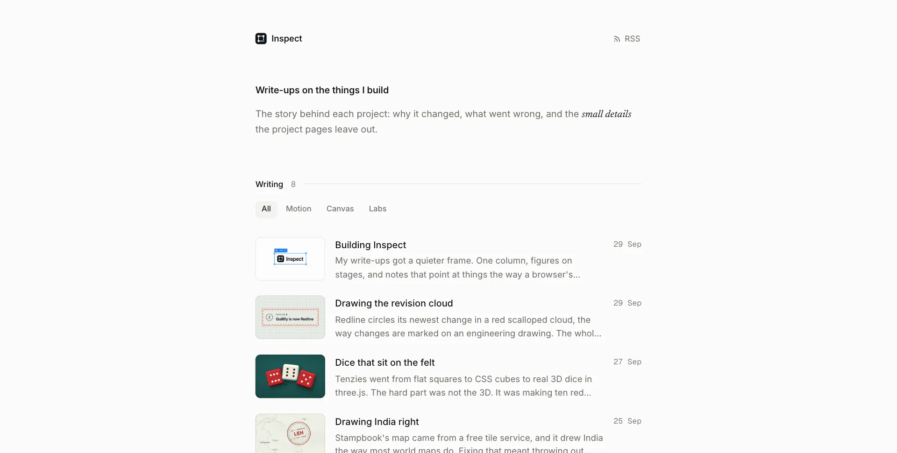
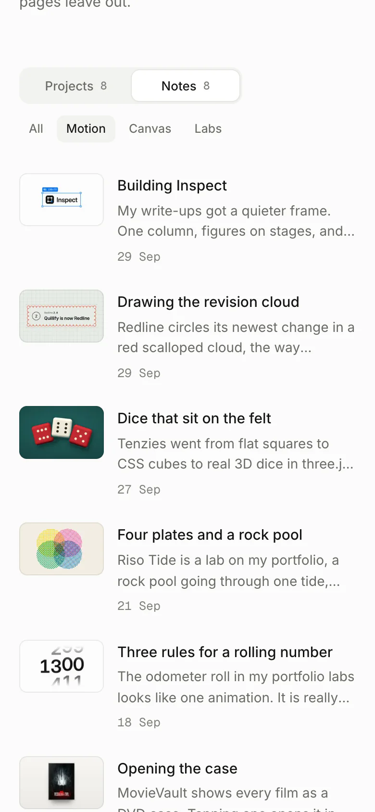
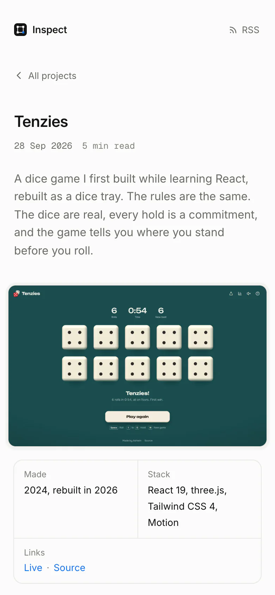
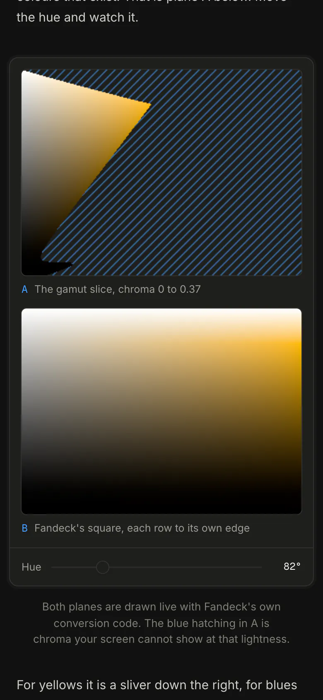
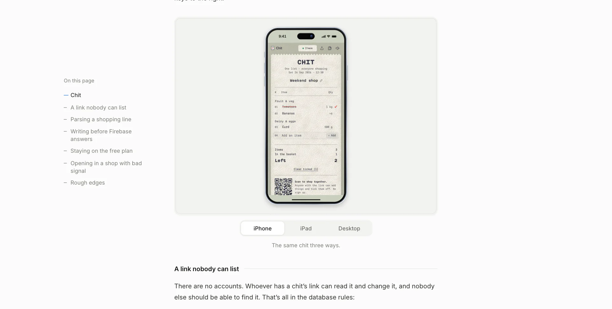
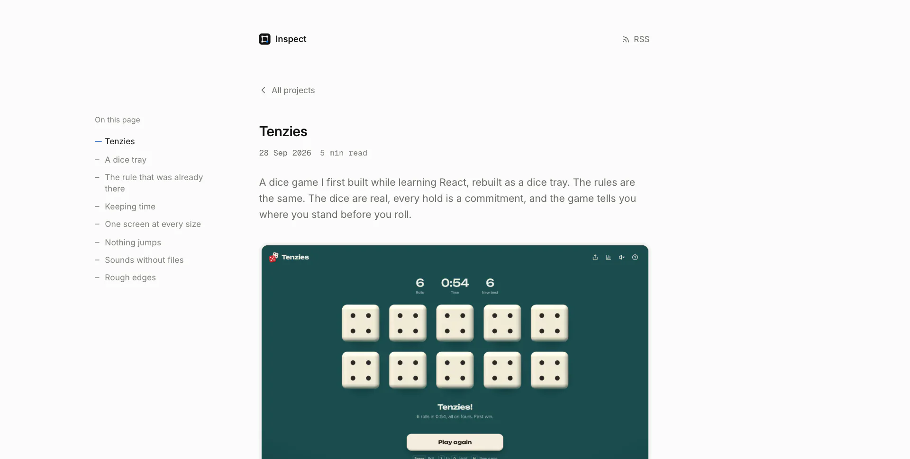
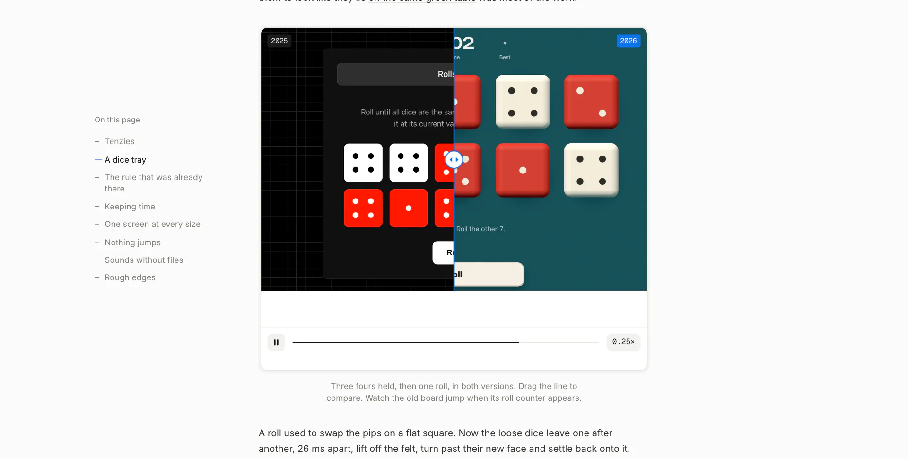

<p align="center">
  <a href="https://inspect.ashwin.co.in">
    
  </a>
</p>

<p align="center">
  <a href="https://inspect.ashwin.co.in"><strong>inspect.ashwin.co.in</strong></a>
  &nbsp;·&nbsp;
  <a href="#what-it-does">what it does</a>
  &nbsp;·&nbsp;
  <a href="#the-design">the design</a>
  &nbsp;·&nbsp;
  <a href="#running-it">running it</a>
</p>

<br>

the source of **[inspect.ashwin.co.in](https://inspect.ashwin.co.in)**, write-ups on the things i build. one column, figures on stages, and notes that point at things the way a browser's inspector does: a blue box with handles, and its size.

## what it does

there are two kinds of post. a **project write-up** is the story of one project: why it changed, how the hard parts work, what went wrong, and its rough edges. a **note** is shorter and about one part of a project: a component, an animation, a fix. each write-up lists the notes on its project, and each note links back to its write-up. the release history lives in [redline](https://redline.ashwin.co.in).

<p align="center">
  
  &nbsp;
  
  &nbsp;
  
</p>

- **projects and notes.** one switch on the home page, with filters for the notes. it swaps the list in place, so the page doesn't reload and nothing under your finger moves.
- **notes that point.** screenshots stay clean until you point at a part of them, or at a note, and that part gets a selection box or a numbered badge. on a phone you tap a note and it stays.
- **boxes that keep up.** clips have a timeline with the noted stretches marked. the box follows what it points at, frame by frame, synced to the frame on screen with `requestVideoFrameCallback`.
- **devices.** the same screen on an iphone, an ipad and a desktop, drawn in css around the screenshot, with the status bar ink picked from the screen's colour.
- **then and now.** two clips of the same move, side by side under one divider, played in sync, with a slow motion switch. a still version does the same for screenshots.
- **live demos.** some figures are the real thing, ported to run on the page: an odometer, oklch planes, a revision cloud and a riso press.
- **code cards and asides.** each code block gets its language and a copy button, built into the html.
- **a feed.** every post goes out on [rss](https://inspect.ashwin.co.in/rss.xml), and there is a sitemap.

## how the switch stays still

the home page and `/notes/` are separate pages, so a plain link between them would reload the page, throw away your scroll and replay the list. instead both pages render both lists, stacked in one grid cell, with the hidden one `inert` and invisible. the cell is as tall as the taller list, so swapping them never changes the page height.

clicking projects or notes, or a filter, is caught in the page. the old list fades out in 120 ms, the new one fades in after it, the pill slides under the labels, and `history.pushState` updates the url and the title. back and forward replay it from `popstate`. the filters sit on the same row as the switch on both pages and only fade, so the list never jumps when they come and go. a direct visit to `/notes/?tag=motion` is filtered before the first frame.

## how moving between pages stays smooth

between pages, only the title travels. it glides from its row into the post, and back, with cross-document view transitions and no client router. the rest of the page crossfades: the old page fades out and the new one fades in on the same curve and the same 280 ms, so their opacities always add up to one and the background never shows through. a crossfade where the two fades don't match is a white flash halfway through.

going back restores the list's scroll in `pagereveal`, before the first frame, so the title lands on its own row. images that haven't arrived 100 ms into a page fade in when they do, instead of popping, and ones that come from the cache show at once. returning visits skip the wait for fonts, since they're cached by then.

## the design

- **quiet on purpose.** a near white page (`#fbfbfa`), grey text, and one blue (`#0a74e8`) for everything that points. dark mode follows your system, with no switch.
- **type.** [inter](https://rsms.me/inter/) for everything, [newsreader](https://fonts.google.com/specimen/Newsreader) italic for the odd word in *italics*, and [geist mono](https://vercel.com/font) for dates, times and sizes.
- **one column.** 620 px of text with figures the same width, and the contents in the left margin on wide screens. the contents follow your scroll and mark the last section once you reach the end. on phones and tablets, a thin bar slides in at the top once the title scrolls away, showing the section you're in and how far through you are. tap it for the contents: a sheet on a phone that you can drag or flick shut, a dropdown on a tablet. the back button closes it. it sits at the top because safari's own bar has the bottom.
- **nothing jumps.** fonts are self-hosted, split by unicode range and preloaded with metric matched fallbacks, heroes and figures have their size before they load, and the first visit fades in once the fonts are ready. layout shift measures 0 on load, while scrolling and while using every figure, on 7 sizes from a 320 px phone to a 2560 px monitor, light and dark, with nothing wider than the screen.

<p align="center">
  
</p>

## the stack

| layer | choices |
| --- | --- |
| site | [astro 7](https://astro.build) with [mdx](https://mdxjs.com), fully static |
| content | one content collection over `projects/` and `notes/`, one folder per post, typed front matter |
| images | `astro:assets`, as avif and webp at three widths |
| fonts | the astro fonts api, self-hosted, with generated fallbacks |
| motion | css, the web animations api, cross document view transitions |
| feeds | [@astrojs/rss](https://docs.astro.build/en/recipes/rss/) and [@astrojs/sitemap](https://docs.astro.build/en/guides/integrations-guide/sitemap/) |
| lint and format | [biome](https://biomejs.dev), with a pre-commit hook |
| hosting | [vercel](https://vercel.com/), as static files, with 301s from the old `/posts/*` urls to `/notes/*` |

## running it

you'll need node 24.x, as required by `package.json`.

```sh
git clone https://github.com/Ashwin-S-Nambiar/Inspect.git
cd Inspect
npm install
npm run dev       # http://localhost:4321
npm run build     # static site in dist/
npm run check     # biome and astro check
```

production indexing is configured for `inspect.ashwin.co.in`; vercel sends `noindex, nofollow` on other hosts, including preview deployments. the sitemap includes the home page, the write-ups and the notes; tag pages and the 404 are marked `noindex`.

### writing a post

a write-up is a folder in [`src/content/projects`](src/content/projects), a note one in [`src/content/notes`](src/content/notes), each with an `index.mdx` and its media beside it. how a write-up is planned, written and captured lives in the `inspect-project` skill.

```yaml
---
title: Tenzies
dek: One line under the title, also used for feeds and link previews.
date: 2026-09-28T13:10:00+05:30
kind: project              # project, build log, deep dive or note
tags: [tenzies, three-js]  # a note's first tag is its project's folder name
draft: false               # drafts show in dev only
project:
  name: Tenzies            # the same name on the write-up and its notes
  icon: ../../../assets/projects/tenzies.svg
  about: One line about the project.
  made: 2024, rebuilt in 2026
  live: https://tenzies.ashwin.co.in
  repo: https://github.com/Ashwin-S-Nambiar/Tenzies
  stack: [React 19, three.js]
hero:
  image: ./win.webp        # the still, or the clip's first frame
  video: ./hero.mp4        # optional, a short muted loop
  alt: what the hero shows
thumb: ./thumb.png         # optional, the list thumbnail if not the hero
---
```

then import what the post needs from `src/components`. positions are percentages of the image or frame, from the top left.

```mdx
<Annotated src={shot} alt="what it shows" marks={[{ x: 4, y: 43, w: 16, h: 5, note: 'A box around this part' }]} />

<Clip src={clip} poster={clipPoster} length={8.5} label="what happens" cues={[{ from: 1, to: 2.3, text: 'A timed note' }]} />

<ClipCompare before={{ src: v1, poster: v1Poster, label: '2024' }} after={{ src: v2, poster: v2Poster, label: '2026' }} length={4} label="what both clips show" />

<DeviceSwitch ground="#C9CFBE" views={[{ label: 'iPhone', kind: 'phone', src: phone, alt: '...' }]} />

<Compare before={old} after={now} beforeLabel="Before" afterLabel="After" beforeAlt="..." afterAlt="..." />

<Aside label="A note">It sits in a grey card between paragraphs.</Aside>
```

clips are h.264 mp4 without sound. a mark or cue without `w` and `h` is a numbered badge. a cue without a position follows `track`, a list of `[time, [x, y, w, h]]` keyframes. `python3 docs/render-og.py` draws every post's link preview card.

site settings live in [`src/site.ts`](src/site.ts): the name, the note filters, and `thumbs`, which turns the list thumbnails on or off.

## the shape of it

```
src/
  site.ts               the name, filters and the thumbnails switch
  content.config.ts     the posts collection and its front matter
  content/projects/     one folder per write-up, media beside it
  content/notes/        one folder per note
  pages/                home, notes, write-ups, tags, rss and the 404
  layouts/Base.astro    the head, header, footer, page transitions and scroll keeping
  layouts/Entry.astro   a post: contents, facts, hero, notes on the project, older and newer
  components/           post list, annotated, clip, clip compare, device frame and switch, compare, aside, hero, code card
  components/demos/     the live figures
  lib/                  post helpers and tooltips
  styles/               tokens, figures and the post column
  assets/fonts/         inter, newsreader italic and geist mono
docs/                   the write-up guide, og card templates and screenshots
public/sw.js            retires the old app's service worker
```

## known rough edges

- **no search.** there are few enough posts to scan, for now.
- **both lists on both pages.** the home page and `/notes/` each carry the other's list so the switch can work in place. it's a few kilobytes of html and eight more small thumbnails.
- **tag pages are separate.** the filters cover motion, canvas and labs; any other tag, from a post's footer, opens its own page.
- **the glide needs a recent browser.** without cross-document view transitions, pages change without the title glide. everything else still works.

<details>
<summary><strong>more screenshots</strong></summary>

<br>





</details>

---

[inspect.ashwin.co.in](https://inspect.ashwin.co.in) · [ashwin.co.in](https://ashwin.co.in) · [redline](https://redline.ashwin.co.in) · [x](https://x.com/ashwinnambiar11) · [github](https://github.com/Ashwin-S-Nambiar)
